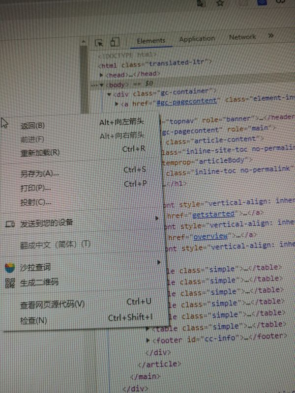

<div style="background-color: #f5f5f5; color: #603; padding:30px 0 0 10px">
<div style="text-align:center; font-size: 26px;margin-bottom: 30px; color: #000;font-weight:bold">
chrome extensions 开发实战
</div>

> 同学们好，欢迎大家参加这次组内分享。因为这算是第一个分享咯，所以我先来抛砖引玉，期待小伙伴们后续带来更多精彩有趣的分享。

> 这次分享的是一个特别可爱的小工具 — chrome extension，我们可以先在[chrome 商店](https://chrome.google.com/webstore/category/extensions)下载一个以.crx 为后缀的压缩包体验下。猜测.crx后缀名可能是因为chrome专用。


> 虽然一个chrome扩展程序比较不起眼，被提及的频率不高，也不算什么高科技，但是小小的身体却蕴藏着大大的能力 —— 自定义您的浏览器。

## 初识 chrome extensions

> chrome 扩展区别于 chrome 插件，更准确的说chrome 插件是指使用 C++等语言对 chrome 浏览器源码的开发。chrome 扩展程序是运行在 chrome 浏览器上，基于 web 技术 （如：HTML、CSS、JavaScript、图片、甚至[WebAssembly](https://webassembly.org/)) 构建的可包含多个组件和功能的单一目的的小型软件；使您能够根据个人需要或偏好来定制 chrome 的功能和行为；那么它具体能做些什么呢：

- 修改当前浏览的 web 内容，例如 整页翻译
- 自定义浏览器启动页、主页、标签页、窗口控制 例如 [Momentum](https://momentumdash.com/)、 掘金
- 通过开放的 chrome API 自定义浏览器的交互、行为、通信、网络请求控制 例如 [AdBlock](https://getadblock.com/)
- 书签控制、下载控制、资源嗅探 例如 [猫抓](https://chrome.google.com/webstore/detail/%E7%8C%AB%E6%8A%93/jfedfbgedapdagkghmgibemcoggfppbb?hl=zh-CN)
- 扩展浏览器的开发者工具 例如 [Vue.js devtools](https://chrome.google.com/webstore/detail/vuejs-devtools/nhdogjmejiglipccpnnnanhbledajbpd)、[React Developer Tools
](https://chrome.google.com/webstore/detail/react-developer-tools/fmkadmapgofadopljbjfkapdkoienihi)
- so on ...

> 许多主流的浏览器都有自己的扩展程序解决方案，包括使用 webkit 内核的国产浏览器，比如搜狗浏览器、QQ 浏览器、[360 极速浏览器小工具](https://ext.chrome.360.cn/webstore/category/%E5%B0%8F%E5%B7%A5%E5%85%B7/%E7%BC%96%E8%BE%91%E6%8E%A8%E8%8D%90)；[firefox](https://addons.mozilla.org/en-US/firefox/extensions/) 等；甚至还有 [safari 扩展](https://developer.apple.com/documentation/safariservices/safari_web_extensions)

<div style="padding: 3px;color: purple; font-size: 16px; margin: 10px 0;">嚯，原来我们每天都在频繁使用的浏览器竟然有这么高的可定制性，那我们亲自动手来开发一个 chrome扩展程序叭！</div>
<div style="text-align:center" >

</div>

## 开发
```javascript
1. mkdir extension-practice && cd extension-practice
2. touch manifest.json
```

#### 1. 配置 manifest.json

一个扩展程序的根目录必须包含一个[manifest.json](https://developer.chrome.com/extensions/manifest)；其中manifest_version、name、version这3个属性是必不可少的。
[这里](https://crxdoc-zh.appspot.com/extensions/manifest)是一个完整的manifest.json配置示例；更详细的属性请参考[官方文档](https://developer.chrome.com/extensions/manifest)。

在 manifest.json 文件中我们需要通过设置[permissions属性](https://developer.chrome.com/extensions/declare_permissions)来声明整个程序生命周期内需要用到的 chrome.\* API 权限；例如 注册"storage"后可以在项目中使用[chrome.storage](https://developer.chrome.com/extensions/storage)对象提供的方法。

#### 2. 编写popup.html
popup是点击[browser_action](https://developer.chrome.com/extensions/browserAction)或者[page_action](https://developer.chrome.com/extensions/pageAction)图标时打开的一个小窗口网页，焦点离开网页就立即关闭，一般用来做一些临时性的交互。下图我们常见的Google页面翻译就是page_action，与browser_action的区别就是只能显示在您配置的特定页面的地址栏右侧；而browser_action是一直显示在右上角的工具栏。
<div style="text-align:center">

</div>

popup页可以包含任意你想要的HTML内容，并且会自适应大小。可以通过default_popup字段来指定popup页面，也可以调用[chrome.browserAction.setPopup()](https://developer.chrome.com/extensions/browserAction#method-setPopup)方法。

配置方式：
``` javascript
{
	"browser_action":
	{
		"default_icon": "img/icon.png",
		// 图标悬停时的标题，可选
		"default_title": "这是一个示例Chrome插件",
		"default_popup": "popup.html"
	}
}
```

需要特别注意的是，由于单击图标打开popup，焦点离开又立即关闭，所以popup页面的生命周期一般很短，需要长时间运行的代码千万不要写在popup里面。

在权限上，它和我们后面用到的background非常类似，它们之间最大的不同是生命周期的不同，popup中可以直接通过chrome.extension.getBackgroundPage()获取background的window对象。

我们通过chrome.runtime.sendMessage() 发出事件，在background.js通过chrome.runtime.onMessage.addListener接收事件并返回响应

#### 3. 编写options.html
[options](https://developer.chrome.com/extensions/options)就是插件的设置页，右键程序有一个"选项"菜单，也可以在插件管理页面找到；

<div style="text-align:center">

</div>

``` javascript
"options_ui": {
	"page": "options/options.html",
	"chrome_style": true,
	"open_in_tab": true
}
```
  
#### 编写background.html/background.js

background，是一个常驻的页面，它的生命周期是插件中所有类型页面中最长的，它随着浏览器的打开而打开，随着浏览器的关闭而关闭，所以通常把需要一直运行的、启动就运行的、全局的代码放在background里面。

如果手动引入了background.html，程序就会有两个background.html，chrome会自动生成一个。

background的权限非常高，几乎可以调用所有的Chrome扩展API（除了devtools），而且它可以无限制跨域，也就是可以跨域访问任何网站而无需要求对方设置CORS。

在manifest.json配置中，background可以通过page指定一张网页，也可以通过scripts直接指定一个JS，Chrome会自动为这个JS生成一个默认的网页：
``` javascript
{
	// 会一直常驻的后台JS或后台页面
	"background":
	{
		// 2种指定方式，如果指定JS，那么会自动生成一个背景页
		"page": "background.html"
		//"scripts": ["js/background.js"]
	},
}
```

鉴于background生命周期太长，长时间挂载后台可能会影响性能，所以Google又弄一个event-pages，在配置文件上，它与background的唯一区别就是多了一个persistent参数，我们的程序就是用的这个：
``` javascript
{
	"background":
	{
		"scripts": ["event-page.js"],
		"persistent": false
	},
}
```
它的生命周期是：在被需要时加载，在空闲时被关闭，什么叫被需要时呢？比如第一次安装、插件更新、有content-script向它发送消息，等等。
#### 调试

1. yarn/npm run watch 监听文件修改并编译。
2. 从右上角菜单->更多工具->扩展程序，或者直接在地址栏输入 chrome://extensions 访问插件管理页；勾选开发者模式即可以文件夹的形式直接加载插件，否则只能安装.crx 格式的文件。Chrome 要求程序必须从它的 Chrome 应用商店安装，其它任何网站下载的都无法直接安装，所以，其实我们可以把 crx 文件解压成文件夹，然后通过开发者模式直接加载。
3. 开发中，代码有任何改动都必须重新加载程序，重新打开即可。
4. 点击扩展程序在弹出来的页面右键=>检查 或在 扩展程序 icon 上右键=>审查弹出内容（popup.html）
5. 我们还用到了[notifications](https://developer.chrome.com/apps/notifications)、[chrome.browserAction.setBadgeText](https://developer.chrome.com/extensions/browserAction#method-setBadgeText)、chrome.(contextMenus)[https://developer.chrome.com/apps/contextMenus]等等APi
## 参考资料

- [官方文档](https://developer.chrome.com/extensions)

## 数据来源

由于支付宝的基金数据通过常规的charles https抓取不到，但是搜索到可以使用天天基金网的接口：

1. 天天基金网/大盘指数：[获取指数接口示例](https://push2.eastmoney.com/api/qt/ulist.np/get?fltt=2&secids=1.000001,0.399001&invt=2&fields=f2,f3,f4,f6,f12,f14,f104,f105,f106&ut=267f9ad526dbe6b0262ab19316f5a25b&cb=jQuery183027144151760481683_1595495878685&_=1595495878944)
接口来源于[指数详情页](http://quote.eastmoney.com/center/hszs.html)
2. 天天基金网/基金详情：[基金数据接口示例](http://fundgz.1234567.com.cn/js/519674.js?rt=1595495344238)

## 扩展阅读

1. 我们当前的程序只能查看数据好像不尽如人意；还可以做什么呢？
   - 怎么打通支付宝的基金页面实现在扩展程序的 popup.html 买卖基金？
2. 这里推荐一个vscode插件[韭菜基金](https://marketplace.visualstudio.com/items?itemName=giscafer.leek-fund)；前端大部分时间都在使用vscode和chrome，可以高度自定义的工具可以带来很多乐趣和效率提升，可以多研究下。

## 总结

chrome为开发者提供了大量的API 我们可以尽情的探索，打造属于自己的优雅的浏览器。
</div>
