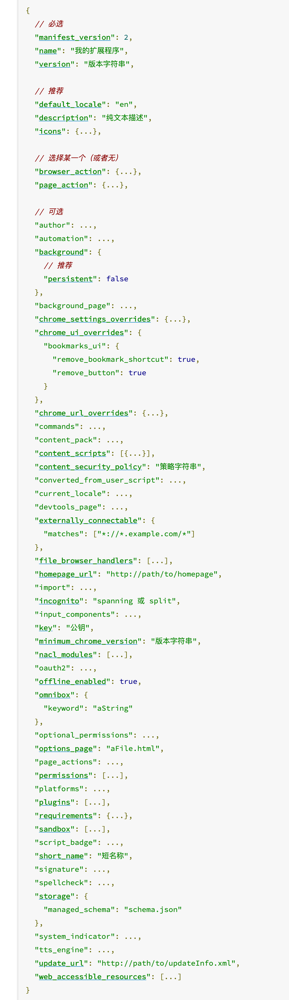

<div style="background-color: #f5f5f5; color: #333">

> 同学们好，欢迎大家参加这次组内分享。因为这算是第一个分享咯，所以我先来抛砖引玉，期待小伙伴们后续带来更多精彩有趣的分享。

> 这次分享的是一个特别可爱的小工具 — chrome extension，我们可以先在[chrome 商店](https://chrome.google.com/webstore/category/extensions)下载一个以.crx 为后缀的压缩包体验下。


> 虽然它比较不起眼，被提及的频率不高，也不算什么高科技，但是小小的身体却蕴藏着大大的能力 - 自定义您的浏览器。

## 初识 chrome extensions

> chrome 扩展区别于 chrome 插件，chrome 插件是指使用 C++等语言对 chrome 浏览器源码的开发。chrome 扩展程序是运行在 chrome 浏览器上，基于 web 技术 （如：HTML、CSS、JavaScript、图片、甚至[WebAssembly](https://webassembly.org/)) 构建的可包含多个组件和功能的单一目的的小型软件；使您能够根据个人需要或偏好来定制 chrome 的功能和行为；那么它具体能做些什么：

- 修改当前浏览的 web 内容，例如 整页翻译
- 自定义浏览器启动页、主页、标签页、窗口控制 例如[Momentum](https://momentumdash.com/) 掘金
- 通过开放的 chrome API 自定义浏览器的交互、行为、通信、网络请求控制 例如[adblock](https://getadblock.com/)
- 书签、下载、资源嗅探 例如 [猫抓](https://chrome.google.com/webstore/detail/%E7%8C%AB%E6%8A%93/jfedfbgedapdagkghmgibemcoggfppbb?hl=zh-CN)
- so on ...

> 很多主流的浏览器都有自己的扩展程序解决方案，包括使用 webkit 内核的国产浏览器，比如搜狗浏览器、QQ 浏览器、[360 极速浏览器小工具](https://ext.chrome.360.cn/webstore/category/%E5%B0%8F%E5%B7%A5%E5%85%B7/%E7%BC%96%E8%BE%91%E6%8E%A8%E8%8D%90)；[firefox](https://addons.mozilla.org/en-US/firefox/extensions/)等；甚至[safari 扩展](https://developer.apple.com/documentation/safariservices/safari_web_extensions)

<div style="padding: 3px;color: purple; font-size: 16px">嚯，原来我们每天都要使用的浏览器竟然有这么高的可定制性，那我们亲自动手来开发一个 chrome扩展程序叭！</div>


## 创造

从右上角菜单->更多工具->扩展程序，或者直接在地址栏输入 chrome://extensions 访问插件管理页；勾选开发者模式即可以文件夹的形式直接加载插件，否则只能安装.crx 格式的文件。Chrome 要求插件必须从它的 Chrome 应用商店安装，其它任何网站下载的都无法直接安装，所以，其实我们可以把 crx 文件解压，然后通过开发者模式直接加载。

开发中，代码有任何改动都必须重新加载插件，在插件管理页按下 Ctrl(command)+R 或者刷新该程序。

```javascript
1. mkdir extension-practice && cd extension-practice
2. touch manifest.json // 声明能被chrome识别的manifest_version、name、version 等属性集合
```

#### 配置 manifest.json

一个扩展程序的根目录必须包含一个[manifest.json](https://developer.chrome.com/extensions/manifest)；其中manifest_version、name、version这3个属性是必不可少的。
下图是一个完整的manifest.json配置示例；完整的属性请参考[官方文档](https://developer.chrome.com/extensions/manifest)



在 manifest.json 文件中我们需要声明整个程序生命周期内需要用到的 chrome.\* API 权限；设置[permissions属性](https://developer.chrome.com/extensions/declare_permissions)；例如 注册'storage'后可以在项目中使用[chrome.storage](https://developer.chrome.com/extensions/storage)
  
  [content-scripts](https://developer.chrome.com/extensions/content_scripts)是Chrome插件中向页面注入脚本的一种形式，我们可以实现通过配置的方式轻松向指定页面注入JS和CSS（如果需要动态注入，可以参考下文），最常见的比如：广告屏蔽、页面CSS修改等，我们这个程序没有用上。


background，是一个常驻的页面，它的生命周期是插件中所有类型页面中最长的，它随着浏览器的打开而打开，随着浏览器的关闭而关闭，所以通常把需要一直运行的、启动就运行的、全局的代码放在background里面。

background的权限非常高，几乎可以调用所有的Chrome扩展API（除了devtools），而且它可以无限制跨域，也就是可以跨域访问任何网站而无需要求对方设置CORS。

经过测试，其实不止是background，所有的直接通过chrome-extension://id/xx.html这种方式打开的网页都可以无限制跨域。

配置中，background可以通过page指定一张网页，也可以通过scripts直接指定一个JS，Chrome会自动为这个JS生成一个默认的网页：

{
	// 会一直常驻的后台JS或后台页面
	"background":
	{
		// 2种指定方式，如果指定JS，那么会自动生成一个背景页
		"page": "background.html"
		//"scripts": ["js/background.js"]
	},
}
需要特别说明的是，虽然你可以通过chrome-extension://xxx/background.html直接打开后台页，但是你打开的后台页和真正一直在后台运行的那个页面不是同一个，换句话说，你可以打开无数个background.html，但是真正在后台常驻的只有一个，而且这个你永远看不到它的界面，只能调试它的代码
这里顺带介绍一下event-pages，它是一个什么东西呢？鉴于background生命周期太长，长时间挂载后台可能会影响性能，所以Google又弄一个event-pages，在配置文件上，它与background的唯一区别就是多了一个persistent参数：

{
	"background":
	{
		"scripts": ["event-page.js"],
		"persistent": false
	},
}
它的生命周期是：在被需要时加载，在空闲时被关闭，什么叫被需要时呢？比如第一次安装、插件更新、有content-script向它发送消息，等等。

除了配置文件的变化，代码上也有一些细微变化，个人这个简单了解一下就行了，一般情况下background也不会很消耗性能的。

[options](https://developer.chrome.com/extensions/options)

[添加右键显示菜单](https://developer.chrome.com/apps/contextMenus)

首先输入基金代码添加基金，将基金添加特别关注后，可以以角标的形式展示在浏览器中。可以在设置中单独开启显示份额与收益选项，在编辑中输入持有的份额，可以计算出每个基金的实时估值与收益，以及总收益。
[Vue2.x](https://cn.vuejs.org/v2/guide/instance.html) + [Webpack4.x](https://v4.webpack.js.org/concepts/plugins/)

当然完全可以直接用 HTML CSS JavaScript
右键 
使用 web worker 实现 ajax 轮询
build 和 build:dev 最大的区别就是 build:dev 把 ajax 轮询放到了 node.js 服务器，让服务器判断数据是否变化通过 websocket 向客户端推送大盘指数数据
websocket

同源策略
从上面的测试可以看出，WebSocket 协议本身不要求同源策略（Same-origin Policy），也就是某个地址为http://a.com的网页可以通过WebSocket连接到ws://b.com。但是，浏览器会发送Origin的HTTP头给服务器，服务器可以根据Origin拒绝这个WebSocket请求。所以，是否要求同源要看服务器端如何检查

部署在 docker 上

扩展常常用一个单独的长时间运行的脚本来管理一些任务或者状态

[background.js](https://developer.chrome.com/extensions/background_pages) 长时间在后台运行 用于实时更新特别关注的基金数据

如同 architecture overview 的解释。背景页是一个运行在扩展进程中的 HTML 页面。它在你的扩展的整个生命周期都存在，同时，在同一时间只有一个实例处于活动状态。

在一个有背景页的典型扩展中，用户界面（比如，浏览器行为或者页面行为和任何选项页）是由沉默视图实现的。当视图需要一些状态，它从背景页获取该状态。当背景页发现了状态改变，它会通知视图进行更新。

清单
请在扩展清单中注册背景页。一般，背景页不需要任何 HTML，仅仅需要 js 文件，比如：

Chrome 浏览器扩展通过 chrome.storage.\* API，可以存取数据或监听数据的变化
chrome.storage.sync 方式实现了自动数据同步，相同的 chrome 用户无论使用什么物理设备，只要以相同的账户登录即可访问存储的数据。设备离线时数据存储在本地，一旦设备上线则同步数据。除非手动卸载
如果用户禁止了数据同步或者没有登录 chrome 账户，则采用 chrome.storage.local 方式

所谓badge就是在图标上显示一些文本，可以用来更新一些小的扩展状态提示信息。因为badge空间有限，所以只支持4个以下的字符（英文4个，中文2个）。badge无法通过配置文件来指定，必须通过代码实现，设置badge文字和颜色可以分别使用setBadgeText()和setBadgeBackgroundColor()。

所谓options页，就是插件的设置页面，有2个入口，一个是右键图标有一个“选项”菜单，还有一个在插件管理页面

7.2.3. content-script主动发消息给后台
content-script.js：

chrome.runtime.sendMessage({greeting: '你好，我是content-script呀，我主动发消息给后台！'}, function(response) {
	console.log('收到来自后台的回复：' + response);
});
background.js 或者 popup.js：

// 监听来自content-script的消息
chrome.runtime.onMessage.addListener(function(request, sender, sendResponse)
{
	console.log('收到来自content-script的消息：');
	console.log(request, sender, sendResponse);
	sendResponse('我是后台，我已收到你的消息：' + JSON.stringify(request));
});
注意事项：

content_scripts向popup主动发消息的前提是popup必须打开！否则需要利用background作中转；
如果background和popup同时监听，那么它们都可以同时收到消息，但是只有一个可以sendResponse，一个先发送了，那么另外一个再发送就无效；


### 调试

yarn run watch 监听文件修改并编译

1. 打开 chrome://extensions 开启开发者模式 加载已解压的扩展程序
2. 点击扩展程序在弹出页面右键/检查 或在 扩展程序 icon 上右键 审查弹出内容

#### 参考资料

- [官方文档](https://developer.chrome.com/extensions)

#### 数据来源

支付宝的基金数据抓取不到，

- 天天基金网/大盘指数：[获取指数接口示例](https://push2.eastmoney.com/api/qt/ulist.np/get?fltt=2&secids=1.000001,0.399001&invt=2&fields=f2,f3,f4,f6,f12,f14,f104,f105,f106&ut=267f9ad526dbe6b0262ab19316f5a25b&cb=jQuery183027144151760481683_1595495878685&_=1595495878944)

接口来源于[指数详情页](http://quote.eastmoney.com/center/hszs.html)

- 天天基金网/基金详情：[基金数据接口示例](http://fundgz.1234567.com.cn/js/519674.js?rt=1595495344238)

#### 扩展

1. 还可以做什么
   怎么打通支付宝的基金页面实现在扩展程序的 popup.html 买卖基金？
   </div>
